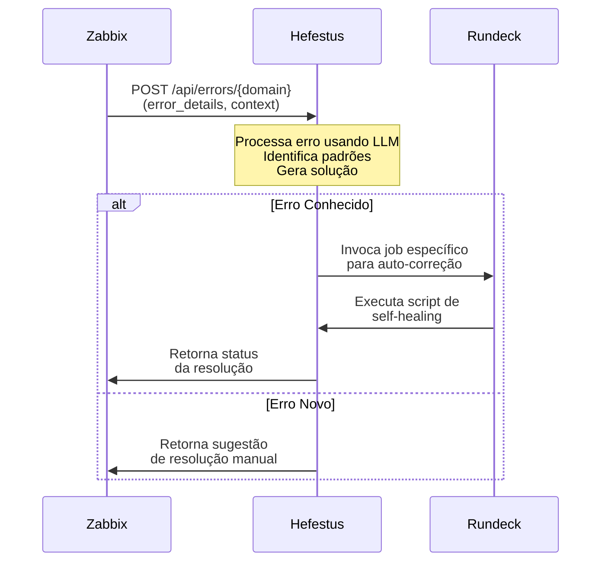

<h1 align="center">Hefestus API 🚀</h1>

<p align="center">
  
</p>

<p align="center">
  <a href="https://go.dev/"></a>
  <a href="LICENSE"></a>
  <a href="#"></a>
  <a href="#📖-documentação"></a>
</p>

**Hefestus** é uma API escrita em Go que utiliza modelos de linguagem (LLMs) locais via **Ollama** para analisar e resolver erros de desenvolvimento em múltiplos domínios, como **Kubernetes**, **GitHub Actions**, e **ArgoCD**.

---

## 🎯 Objetivo  

O Hefestus foi desenvolvido como um projeto de estudo para explorar:
- Como utilizar **Golang** para criar uma API de troubleshooting de erros de desenvolvimento.
- Algumas ideias para integrar detecção de erros e automação de solução em pipelines de CI/CD e outras ferramentas (e.g., Teams, Slack, GitHub).

Você pode configurar o Hefestus para receber erros de endpoints ou pipelines e obter soluções diretamente no console ou em outros sistemas integrados.  

Particularmente, eu gosto muito do  tema `observabilidade` e queria construir algo que pudesse maximizar o efeito de ferramentas open-source como o `Zabbix` e o `Rundeck`. 

Então construi o hefestus pra ser parte de uma solução que `monitora, detecta, resolve e comunica` times usando apenas ferramentas open-source, incluindo agentes de IA no fluxo, para a resolução dos problemas. O hefestus entra nesse meio, interpretando o erro e encaminhando a resposta para o próximo agente, com o poder de invocar os scripts do rundeck de acordo com a compreensão do erro, sendo mais assertivo naquele primeiro momento de problema.

No caso de integração com pipelines, a idéia é semelhante, capturar o erro e passar pelo endpoint da API, obtendo no final uma sugestão de solução para o cliente final, usuário da pipeline.

A idéia é usar a API como um `man-in-the-middle` entre o conteúdo do log e a automação de `self-healing`.




---

## 🌟 Principais recursos

| Funcionalidade               | Descrição                                                                                       |
|------------------------------|-------------------------------------------------------------------------------------------------|
| **Arquitetura Multi-Domínio**| Processamento dinâmico com prompts especializados para cada domínio (e.g., Kubernetes, GitHub). |
| **Integração com LLMs**      | Usa **Ollama** para processar modelos open-source localmente com prompts otimizados.            |
| **Dicionários de Erros**     | Banco de dados com padrões de erros por domínio, aumentando a precisão das soluções.           |
| **Swagger UI**               | Documentação interativa para testar endpoints da API.                                          |
| **Controle de Parâmetros**   | Ajustes finos por domínio: temperatura, tokens, etc.                                           |

---

## 🛠️ Tecnologias utilizadas

- **Go 1.21+**: Linguagem de programação principal.
- **Gin**: Framework web para construção da API.
- **Ollama**: Para processar modelos de linguagem localmente e fazer com que as respostas sejam específicas.
- **Swagger**: Documentação interativa da API, para ficar fácil de navegar, apesar de no momento só possuir um endpoint.
- **Docker**: Containerização para fácil deploy local.

---

## 📚 Estrutura do projeto

```plaintext
hefestus/
├── cmd/server/          # Ponto de entrada da aplicação
├── internal/
│   ├── models/         # Estruturas de dados
│   └── services/       # Lógica de negócio
├── pkg/
│   └── ollama/         # Cliente LLM
├── config/
│   └── domains.json    # Configurações de domínio
└── data/patterns/      # Dicionários de erros
```

---

## 🚀 Como usar?

### Pré-requisitos

Certifique-se de ter as seguintes dependências instaladas:
- **Go** (1.21+)
- **Docker** (para rodar a aplicação em contêiner, opcional)

### Instalação

```bash
git clone https://github.com/yourusername/hefestus.git
cd hefestus
cp .env.example .env
go run cmd/server/main.go
```

---

## 🔍 Exemplos de Uso

### **Exemplo de erro no kubernetes**
```bash
curl -X POST http://localhost:8080/api/errors/kubernetes \
  -H "Content-Type: application/json" \
  -d '{
    "error_details": "0/3 nodes are available: insufficient memory",
    "context": "Deploying new pod in production cluster"
  }'
```

#### **Resposta**
```json
{
  "error": {
    "causa": "Nodes sem memória disponível",
    "solucao": "kubectl describe nodes\nkubectl top nodes"
  },
  "message": "Resolution retrieved successfully"
}
```

### **Swagger UI**
Acesse a documentação interativa no navegador:
```
http://localhost:8080/swagger/index.html
```

---

## 🐳 Docker

### Build da imagem docker
```bash
docker build -t hefestus:latest .
```

### Executar o container
```bash
docker run -d \
    -p 8080:8080 \
    -e OLLAMA_MODEL=qwen2.5:1.5b \
    --name hefestus \
    hefestus:latest
```

---

## 🔧 Outras configs...

### Estrutura de chaveamento por domínio

Exemplo de configuração de domínio (`domains.json`):
```json
{
  "domains": [
    {
      "name": "kubernetes",
      "prompt_template": "Analyze the Kubernetes error and suggest solutions.",
      "parameters": {
        "temperature": 0.7,
        "max_tokens": 150
      },
      "dictionary_path": "data/patterns/kubernetes.json"
    }
  ]
}
```

### Exemplo de `error_pattern`
```json
{
  "patterns": {
    "insufficient_resources": {
      "pattern": "\\b(insufficient|not enough)\\s+(cpu|memory|resources)\\b",
      "category": "RESOURCE_LIMITS",
      "solutions": [
        "Verifique o uso de recursos no cluster.",
        "Considere aumentar os recursos alocados."
      ]
    }
  }
}
```

---

## 💡 Contribuindo

Apesar de um projeto de estudo, contribuições são bem-vindas! Para contribuir:
1. Faça um fork do repositório.
2. Crie um branch para sua feature ou correção: `git checkout -b minha-feature`.
3. Faça um commit das suas alterações: `git commit -m 'Adiciona minha nova feature'`.
4. Faça o push para o branch: `git push origin minha-feature`.
5. Abra um pull request.

---

## 📝 Licença

Este projeto está licenciado sob a [MIT License](LICENSE).

---

## 📫 Contato

Se você tiver dúvidas, entre em contato via [GitHub Issues](https://github.com/yourusername/hefestus/issues) e ficarei contente em responder você ^^;

---