<h1 align="center">Hefestus API 🚀</h1>

<p align="center">
  
</p>

<p align="center">
  <a href="https://go.dev/"></a>
  <a href="LICENSE"></a>
  <a href="#"></a>
  <a href="#📖-documentation"></a>
</p>

**Hefestus** is a Go API that uses local Language Models (LLMs) via **Ollama** to analyze and resolve development errors across multiple domains, such as **Kubernetes**, **GitHub Actions**, and **ArgoCD**.

---

## 🎯 Objective

Hefestus was developed as a study project to explore:
- How to use **Golang** to create a development error troubleshooting API.
- Ideas for integrating error detection and solution automation in CI/CD pipelines and other tools (e.g., Teams, Slack, GitHub).

You can configure Hefestus to receive errors from endpoints or pipelines and get solutions directly in the console or other integrated systems.

I particularly enjoy the topic of `observability` and wanted to build something that could maximize the effect of open-source tools like `Zabbix` and `Rundeck`.

So I built Hefestus to be part of a solution that `monitors, detects, resolves and communicates` with teams using only open-source tools, including AI agents in the flow, for problem resolution. Hefestus fits in the middle, interpreting the error and forwarding the response to the next agent, with the power to invoke Rundeck scripts based on error understanding, being more assertive in that first moment of a problem.

For pipeline integration, the idea is similar: capture the error and pass it through the API endpoint, ultimately obtaining a solution suggestion for the end user of the pipeline.

The idea is to use the API as a `man-in-the-middle` between the log content and the `self-healing` automation.

Something like this:

```mermaid
flowchart LR
    Zabbix(Zabbix) --> |POST /api/errors/domain| Hefestus(Hefestus)
    Hefestus --> |Processa Erro| LLM[LLM Processing]
    LLM --> |Pattern Match| Decision{Conhecido?}
    Decision --> |Sim| Decision2{Pattern Específico?}
    Decision2 --> |Executa Self-Healing| Rundeck(Rundeck)
    Rundeck --> |Executa| Healing[Self-Healing Script]
    Healing --> |Status| Response[Retorna Resultado]
    Decision2 --> |Envia Mensagem| SlackTeams[Slack & Teams]
    SlackTeams --> |Notificação| Response2[Retorna Notificação]
    Decision --> |Não| Response3[Mensagem sem contexto do erro]
```




---

## 🌟 Key Features

| Feature                    | Description                                                                                    |
|---------------------------|------------------------------------------------------------------------------------------------|
| **Multi-Domain Architecture**| Dynamic processing with specialized prompts for each domain (e.g., Kubernetes, GitHub).       |
| **LLM Integration**        | Uses **Ollama** to process open-source models locally with optimized prompts.                  |
| **Error Dictionaries**     | Database with error patterns by domain, increasing solution accuracy.                          |
| **Swagger UI**             | Interactive documentation for testing API endpoints.                                           |
| **Parameter Control**      | Fine-tuning by domain: temperature, tokens, etc.                                              |

---

## 🛠️ Technologies Used

- **Go 1.21+**: Main programming language.
- **Gin**: Web framework for API construction.
- **Ollama**: For processing language models locally and making responses specific.
- **Swagger**: Interactive API documentation, for easy navigation, although currently with only one endpoint.
- **Docker**: Containerization for easy local deployment.

---

## 📚 Structure 

```plaintext
hefestus/
├── cmd/server/          # entrypoint
├── internal/
│   ├── models/         # data structure
│   └── services/       # Logics
├── pkg/
│   └── ollama/         # ollama clienmt
├── config/
│   └── domains.json    # domain configs
└── data/patterns/      # error dictionaries
```

---

## 🚀 How to Use?

### Prerequisites

Make sure you have the following dependencies installed:
- **Go** (1.21+)
- **Docker** (for running the application in container, optional)

### Installation

```bash
git clone https://github.com/yourusername/hefestus.git
cd hefestus
cp .env.example .env
go run cmd/server/main.go
```

---

## 🔍 Usage

### **Usage on kubernetes**
```bash
curl -X POST http://localhost:8080/api/errors/kubernetes \
  -H "Content-Type: application/json" \
  -d '{
    "error_details": "0/3 nodes are available: insufficient memory",
    "context": "Deploying new pod in production cluster"
  }'
```

#### **response**
```json
{
  "error": {
    "causa": "Nodes sem memória disponível",
    "solucao": "kubectl describe nodes\nkubectl top nodes"
  },
  "message": "Resolution retrieved successfully"
}
```

### **Swagger UI**
Access the documentation at:
```
http://localhost:8080/swagger/index.html
```

---

## 🐳 Docker

### Build docker image
```bash
docker build -t hefestus:latest .
```

### run container
```bash
docker run -d \
    -p 8080:8080 \
    -e OLLAMA_MODEL=qwen2.5:1.5b \
    --name hefestus \
    hefestus:latest
```

---

## 🔧 Other Configurations...

### Domain Keying Structure

Example of domain configuration (`domains.json`):
```json
{
  "domains": [
    {
      "name": "kubernetes",
      "prompt_template": "Analyze the Kubernetes error and suggest solutions.",
      "parameters": {
        "temperature": 0.7,
        "max_tokens": 150
      },
      "dictionary_path": "data/patterns/kubernetes.json"
    }
  ]
}
```

### `error_pattern` example
```json
{
  "patterns": {
    "insufficient_resources": {
      "pattern": "\\b(insufficient|not enough)\\s+(cpu|memory|resources)\\b",
      "category": "RESOURCE_LIMITS",
      "solutions": [
        "Check cluster resource usage.",
        "Consider increasing allocated resources."
      ]
    }
  }
}
```

---

## 🧪 Testing

This project includes comprehensive test coverage for all components:

### Unit Tests
- **Models**: 100% test coverage for all data structures with JSON serialization/deserialization validation
- **Constructor Functions**: Tests for all `New*` constructor functions

### Integration Tests  
- **API Endpoints**: Validates all REST endpoints work correctly
- **Swagger UI**: Ensures Swagger documentation is accessible and properly structured
- **Model Compatibility**: Verifies backward compatibility of refactored models

### E2E Tests
- **Playwright Tests**: Browser automation tests for complete Swagger UI interaction
- **Schema Validation**: Validates API schemas through the Swagger interface

To run tests:
```bash
# Unit tests
go test ./internal/models -cover

# Integration tests (requires running server)
go test ./test -v

# E2E tests (requires Playwright)
cd test && npm run test:e2e
```

See [test/README.md](test/README.md) for detailed testing instructions.

---

## 💡 Contributing

Although this is a study project, contributions are welcome! To contribute:
1. Fork the repository.
2. Create a branch for your feature or fix: git checkout -b my-feature.
3. Commit your changes: git commit -m 'Add my new feature'.
4. Push to the branch: git push origin my-feature.
5. Open a pull request.

---

📝 License
This project is licensed under the [MIT License](LICENSE).

---

## 📫 Contato

If you have any questions, reach out via GitHub Issues and I'll be happy to help! ^^;

---